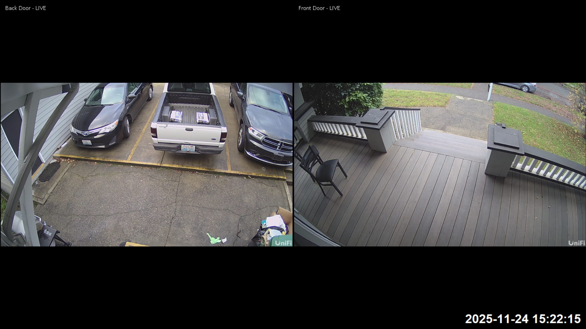

# UniFi Protect Multi-Camera Viewer (Viewport Alternative)

A Python application that displays multiple UniFi Protect camera streams in a dynamic fullscreen grid layout using Tkinter. Features automatic camera discovery, RTSP stream management, and motion detection with visual highlighting.

## Camera View



## Features

- **Dynamic Grid Layout**: Automatically arranges cameras in an N×N grid based on the number of detected cameras
- **UniFi Protect Integration**: Automatically discovers cameras via UniFi Protect Integration API
- **RTSP Stream Management**: Automatically creates and manages RTSP streams of the desired quality
- **Motion Detection**: Visual motion highlighting with pulsing blue border (trailing buffer)
- **Flask Webhook Server**: Receives motion detection events from UniFi Protect
- **Automatic Reconnection**: Streams automatically reconnect on failure with configurable retry delay
- **Fullscreen Display**: Clean fullscreen interface with date/time overlay
- **Status Overlays**: Real-time status indicators (LIVE, Frozen, reconnecting) on each camera feed

## Requirements

- **Python** 3.9+
- **UniFi Protect** system with Integration API access
- **FFmpeg** (recommended for better RTSP codec support)

## Configuration

Edit `config.py` to configure:

- `API_KEY`: Your UniFi Protect Integration API key
- `UNIFI_HOST`: IP address of your UniFi Protect console (default: `192.168.1.1`)
- `STREAM_QUALITY`: RTSP stream quality - `"high"`, `"medium"`, or `"low"` (default: `"high"`)
- `RETRY_SECONDS`: Reconnection delay in seconds (default: `60`)
- `ENABLE_MOTION_DETECTION`: Enable/disable motion highlighting (default: `True`)

## Usage

1. Configure your UniFi Protect API credentials in `config.py`
2. Set up a webhook in UniFi Protect pointing to `http://<your-pi-ip>:5000/motion`
3. Run the application


## Motion Detection

Motion events are received via webhook from UniFi Protect. When motion is detected:
- A pulsing blue border appears around the affected camera feed
- The border remains visible after motion stops
- Motion detection can be disabled via `ENABLE_MOTION_DETECTION` in `config.py`

## Webhook Setup

Configure UniFi Protect to send motion events to:
```
http://<raspberry-pi-ip(or any device)>:5000/motion
```

IMPORTANT: The webhook payload should include the camera name in `alarm.name` (e.g., "Front Door", "Back Door").
