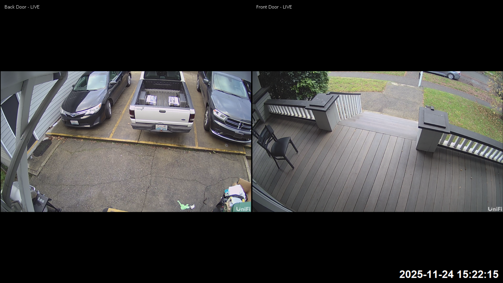

# UniFi Protect Multi-Camera Viewer ([Viewport](https://store.ui.com/us/en/products/ufp-viewport) Alternative)

A Python application that displays multiple UniFi Protect camera streams in a dynamic fullscreen grid layout using Tkinter. Features automatic camera discovery, RTSP stream management, and a web control panel for video playback overlays.

## Camera View



## Features

- **Dynamic Grid Layout**: Automatically arranges cameras in an N×N grid based on the number of detected cameras
- **UniFi Protect Integration**: Automatically discovers cameras via UniFi Protect Integration API
- **RTSP Stream Management**: Automatically creates and manages RTSP streams of the desired quality
- **Video Control Panel**: Web UI to trigger MP4/MOV playback on stream windows
- **Video Playback Overlay**: Play videos (MP4/MOV) overlaid on any camera feed in the grid
- **Scheduled Video Playback**: Configure videos to play automatically at specific times (24h format)
- **Button Management**: Add, remove, and reorder video buttons via the settings panel
- **Automatic Reconnection**: Streams automatically reconnect on failure with configurable retry delay
- **Fullscreen Display**: Clean fullscreen interface with date/time overlay
- **Status Overlays**: Real-time status indicators (LIVE, Frozen, reconnecting) on each camera feed

## Requirements

- **Python** 3.9+
- **UniFi Protect** system with Integration API access
- **FFmpeg** (recommended for better RTSP codec support)

## Configuration

Copy `config.example.py` to `config.py` and edit:

- `API_KEY`: Your UniFi Protect Integration API key
- `UNIFI_HOST`: IP address of your UniFi Protect console (e.g. `192.168.1.1`)
- `STREAM_QUALITY`: RTSP stream quality - `"high"`, `"medium"`, or `"low"`
- `RETRY_SECONDS`: Reconnection delay in seconds (default: `60`)
- `VIDEOS_FOLDER`: Folder for MP4 files (relative to project root)
- `BUTTONS_JSON`: Path to video button definitions (default: `buttons.json`)
- `SCHEDULED_VIDEOS`: List of `{"time": "HH:MM", "file": "filename.mp4"}` for scheduled playback. Optional camera: `"stream": 0`, `"streams": [0, 1]`, `"camera": "Front cam"`, or `"cameras": ["Front cam", "Back cam"]`
- `CONTROL_PANEL_PORT`: Web control panel port (default: `5000`)
- `CONTROL_PANEL_BASE_PATH`: Base URL path for control panel (default: `"/"`)

## Usage

1. Configure your UniFi Protect API credentials in `config.py`
2. Run the application

   ```bash
   python main.py
   ```

3. Access the web control panel at `http://<your-ip>:5000` to add videos and trigger playback on stream windows

## Raspberry Pi Setup

Use the provided install script for a one-time setup on Raspberry Pi 5 (or Pi 4):

```bash
chmod +x install_pi.sh
./install_pi.sh
```

The script will:

- Install system dependencies (Python, ffmpeg, etc.)
- Create a virtual environment and install Python packages
- **Prompt for your UniFi Protect API key and host address** to configure the app
- Create `start_cams.sh` and configure autostart so the app runs on boot

Ensure **Desktop Autologin** is enabled in `raspi-config` (System Options → Boot / Auto Login → Desktop Autologin).
